```{r setup, include=FALSE}
knitr::opts_chunk$set(
  echo    = FALSE,
  warning = FALSE,
  message = FALSE,
  fig.align = "center",
  out.width = "90%"
)

library(tidyverse)
library(vegan)
library(indicspecies)
library(knitr)
library(kableExtra)
library(ggrepel)

set.seed(123)

# ── Source the preparation script ──────────────────────────────────────────────
# Gives: mat_strict, meta_strict, nmds_strict, perm_strict, gap_tbl,
#        meta_core_inland, mat_core_inland, nmds_core_inland, fit_core_inland,
#        community_long_paired, outlier_plots, vars_driver_strict_final, driver_final
source("v_plants_prep.R", local = .GlobalEnv)

# ── PERMANOVA summary ──────────────────────────────────────────────────────────
perm_r2  <- round(perm_strict[1, "R2"] * 100, 1)
perm_p   <- perm_strict[1, "Pr(>F)"]
perm_f   <- round(perm_strict[1, "F"], 2)
perm_df1 <- perm_strict[1, "Df"]
perm_df2 <- perm_strict[2, "Df"]
n_plots  <- length(unique(meta_strict$plot_number))
n_taxa   <- ncol(mat_strict)
gap_range  <- range(meta_strict$gap_years, na.rm = TRUE)
gap_med    <- round(median(meta_strict$gap_years, na.rm = TRUE), 1)

# ── Bray–Curtis per plot ───────────────────────────────────────────────────────
bc_mat <- as.matrix(vegdist(mat_strict, method = "bray"))

plot_bc <- meta_strict %>%
  mutate(row_idx = row_number()) %>%
  group_by(plot_number) %>%
  summarise(
    idx_first = row_idx[sample == "first"],
    idx_last  = row_idx[sample == "last"],
    .groups   = "drop"
  ) %>%
  mutate(bc = map2_dbl(idx_first, idx_last, ~ bc_mat[.x, .y]))

env_first <- meta_strict %>%
  filter(sample == "first") %>%
  select(plot_number, any_of(c("soil_type_name", "moisture_name",
                                "habitat_type_name")))

plot_bc_env <- plot_bc %>%
  left_join(env_first, by = "plot_number")

plot_bc_gap <- plot_bc %>%
  left_join(gap_tbl %>% select(plot_number, gap_years), by = "plot_number") %>%
  filter(!is.na(gap_years), !is.na(bc))

# Linear + Spearman: BC ~ gap years
lm_gap    <- lm(bc ~ gap_years, data = plot_bc_gap)
lm_sum    <- summary(lm_gap)
slope_est <- round(coef(lm_gap)["gap_years"], 4)
r2_gap    <- round(lm_sum$r.squared, 3)
p_gap     <- pf(lm_sum$fstatistic[1], lm_sum$fstatistic[2],
                lm_sum$fstatistic[3], lower.tail = FALSE)
cor_gap   <- cor.test(plot_bc_gap$gap_years, plot_bc_gap$bc,
                      method = "spearman", exact = FALSE)

# BC overall summary
bc_overall_med  <- round(median(plot_bc$bc, na.rm = TRUE), 3)
bc_overall_mean <- round(mean(plot_bc$bc, na.rm = TRUE), 3)

# ── Bray–Curtis by soil type ──────────────────────────────────────────────────
bc_soil_tbl <- plot_bc_env %>%
  filter(!is.na(soil_type_name)) %>%
  group_by(soil_type_name) %>%
  summarise(
    n         = n(),
    median_bc = round(median(bc, na.rm = TRUE), 3),
    mean_bc   = round(mean(bc,   na.rm = TRUE), 3),
    sd_bc     = round(sd(bc,     na.rm = TRUE), 3),
    .groups   = "drop"
  ) %>%
  arrange(desc(median_bc))

# ── Paired Wilcoxon for vegetation descriptors ─────────────────────────────────
univar_vars <- intersect(
  c("haplontuthekja", "vegetation_height_mean", "total_cover", "soil_depth"),
  names(meta_strict)
)

# Pivot each variable individually so the output columns are always named
# "first" / "last" regardless of how many variables are in univar_vars.
# A single-column pivot_wider names outputs after names_from values only;
# a multi-column pivot prepends the value column name — pivoting one at a
# time avoids this ambiguity entirely.
wilcox_res <- map_dfr(univar_vars, function(v) {
  wide_v <- meta_strict %>%
    select(plot_number, sample, all_of(v)) %>%
    pivot_wider(names_from = sample, values_from = all_of(v))
  x  <- wide_v[["first"]]
  y  <- wide_v[["last"]]
  if (is.null(x) || is.null(y) || length(x) == 0L) {
    return(tibble(variable = v, n = 0L,
                  median_first = NA_real_, median_last = NA_real_,
                  median_delta = NA_real_, p = NA_real_))
  }
  cc <- complete.cases(x, y)
  n  <- sum(cc)
  if (n < 3L) {
    return(tibble(variable = v, n = n,
                  median_first = NA_real_, median_last = NA_real_,
                  median_delta = NA_real_, p = NA_real_))
  }
  wt <- wilcox.test(y[cc], x[cc], paired = TRUE, conf.int = TRUE)
  tibble(
    variable     = v,
    n            = n,
    median_first = round(median(x[cc], na.rm = TRUE), 2),
    median_last  = round(median(y[cc], na.rm = TRUE), 2),
    median_delta = round(median(y[cc] - x[cc], na.rm = TRUE), 2),
    p            = wt$p.value
  )
}) %>%
  # Guard: if all p values are NA (no testable variables) create the column
  # so downstream mutate() doesn't fail
  { if (nrow(.) == 0L || !"p" %in% names(.))
      mutate(., p_adj = numeric(0), sig = character(0))
    else
      mutate(.,
        p_adj = p.adjust(p, method = "BH"),
        sig   = case_when(p_adj < 0.001 ~ "***",
                          p_adj < 0.01  ~ "**",
                          p_adj < 0.05  ~ "*",
                          TRUE          ~ "ns"))
  }

# ── DCA + habitat groups ───────────────────────────────────────────────────────
# DCA on the inland matrix (coastal habitat types already excluded in prep)
dca_inland <- decorana(mat_core_inland)

site_dca <- as.data.frame(scores(dca_inland, display = "sites")) %>%
  bind_cols(
    meta_core_inland %>%
      select(plot_number, sample,
             any_of(c("habitat_type_name", "moisture_name", "soil_type_name")))
  )

# DCA1 outlier threshold: 2 SD units of species turnover
dca_thresh      <- 2.0
dca_outlier_ids <- site_dca %>%
  filter(DCA1 > dca_thresh) %>%
  distinct(plot_number) %>%
  pull(plot_number)

# Habitat group assignment following Vistgerðir á Íslandi L-code hierarchy
meta_hab_r <- meta_core_inland %>%
  filter(!plot_number %in% dca_outlier_ids) %>%
  mutate(
    habitat_group = case_when(
      str_detect(habitat_type_name,
        regex("flóavist|mýravist|Rekjuvist|Dýjavist|Hrossanálarvist",
              ignore_case = TRUE)) ~ "mire_fen",
      str_detect(habitat_type_name,
        regex("móavist|Víðikjarrvist|Víðimóavist",
              ignore_case = TRUE)) ~ "heath",
      str_detect(habitat_type_name,
        regex("hraunavist", ignore_case = TRUE))  ~ "lava",
      TRUE                                         ~ "other"
    )
  )

hab_display <- c(
  mire_fen = "Mýrar og flóar (L8)",
  heath    = "Móar (L10)",
  lava     = "Hraunvist (L6)",
  other    = "Annað"
)

hab_pair_counts <- meta_hab_r %>%
  filter(sample == "first") %>%
  count(habitat_group) %>%
  arrange(desc(n)) %>%
  mutate(
    habitat_label = hab_display[habitat_group],
    n_surveys     = n * 2L
  )

groups_sufficient <- hab_pair_counts %>%
  filter(n >= 10) %>%
  pull(habitat_group)

# BC by habitat group
bc_hab_r <- plot_bc %>%
  left_join(
    meta_hab_r %>% filter(sample == "first") %>%
      select(plot_number, habitat_group) %>% distinct(),
    by = "plot_number"
  ) %>%
  left_join(gap_tbl %>% select(plot_number, gap_years), by = "plot_number") %>%
  filter(!is.na(bc), !is.na(habitat_group))

bc_hab_tbl <- bc_hab_r %>%
  filter(habitat_group %in% groups_sufficient) %>%
  group_by(habitat_group) %>%
  summarise(
    n         = n(),
    median_bc = round(median(bc), 3),
    mean_bc   = round(mean(bc),   3),
    sd_bc     = round(sd(bc),     3),
    .groups   = "drop"
  ) %>%
  mutate(habitat_label = hab_display[habitat_group]) %>%
  arrange(desc(median_bc))

# Habitat type detail within each group
hab_type_detail <- meta_hab_r %>%
  filter(sample == "first", habitat_group %in% groups_sufficient) %>%
  count(habitat_group, habitat_type_name, sort = TRUE) %>%
  mutate(habitat_label = hab_display[habitat_group])

# Helper: format a p-value for inline display
fmt_p <- function(p, digits = 3) {
  if (is.na(p)) return("NA")
  if (p < 0.001) return("< 0.001")
  paste0("= ", round(p, digits))
}
```

```{r indval-run, cache=TRUE, include=FALSE}
# IndVal.g with 999 permutations — cached to avoid re-running on every knit
group_vec     <- ifelse(meta_strict$sample == "first", 1L, 2L)
indval_result <- multipatt(
  mat_strict,
  cluster = group_vec,
  control = how(nperm = 999),
  func    = "IndVal.g",
  duleg   = TRUE
)
indval_tbl <- indval_result$sign %>%
  rownames_to_column("taxon") %>%
  as_tibble() %>%
  rename(group = index) %>%
  mutate(
    survey = if_else(group == 1L, "Fyrsta könnun (first)", "Síðasta könnun (last)"),
    p_adj  = p.adjust(p.value, method = "BH"),
    sig    = case_when(p.value < 0.001 ~ "***",
                       p.value < 0.01  ~ "**",
                       p.value < 0.05  ~ "*",
                       TRUE            ~ "ns")
  ) %>%
  filter(p.value <= 0.05) %>%
  arrange(survey, p.value)

n_indval_first <- sum(indval_tbl$group == 1L)
n_indval_last  <- sum(indval_tbl$group == 2L)
```

---

# Study design and dataset

This report summarises a paired resurvey analysis (endurkönnunargreining) of
vascular plant communities (gróðursamfélög háplantna) across Iceland. Each of
the **`r n_plots` plots (stikusvæði)** was visited twice — an original survey
(fyrsta könnun) and a resurvey (endurkönnun) — yielding `r n_plots * 2`
independent community samples. Survey intervals (endurkönnunarbil) range from
**`r gap_range[1]` to `r gap_range[2]` years** (median `r gap_med` years).
Species cover was recorded on the Braun–Blanquet scale (þekjukvarði
Braun–Blanquet); in all analyses cover midpoints are used as numeric values.
The dataset spans **`r n_taxa` taxa** after exclusion of non-vascular species
and taxa flagged for quality issues.

Three plots dominated by coastal sand and salt-marsh specialists
(*Leymus arenarius*, *Honckenya peploides*, *Cakile maritima*) were identified
as community outliers by NMDS (non-metric multidimensional scaling) and are
treated separately in Section \@ref(coastal). All remaining analyses use the
**`r n_plots - 3` inland plots**.

---

# Was there detectable compositional change? {#permanova}

A paired PERMANOVA (adonis2, Bray–Curtis distances, 999 permutations,
strata = plot) tested whether plant communities differed between first and last
survey. Permutations were constrained within each plot, ensuring that the test
detects only *within-plot* temporal change and is not confounded by the large
compositional differences between habitat types.

**Result:** The temporal contrast is statistically unambiguous
(F(`r perm_df1`, `r perm_df2`) = `r perm_f`, R² = `r perm_r2`%,
p `r fmt_p(perm_p)`). The R² represents the proportion of *total* compositional
variance attributable to the first-vs-last contrast; the low value is expected
and ecologically appropriate — a heath (mói) is still a heath after a decade,
it simply has a different species mixture. The F-statistic and permutation
p-value are the relevant indicators of whether change occurred at all, and both
are unambiguous.

---

# Community ordination {#ordination}

## NMDS trajectory plot (inland plots)

The trajectory plot below shows, for each plot, an arrow from the community
composition recorded at the first survey to that recorded at the last survey.
Arrows are positioned in ordination space (NMDS, Bray–Curtis); a long arrow
indicates large compositional change, a short arrow small change. The direction
of the arrow reflects the *type* of change — whether communities shifted
towards drier, wetter, taller, or more open conditions along the underlying
environmental gradients.

```{r fig-nmds-traj, fig.cap="**Figure 1.** NMDS trajectory plot of inland vascular plant communities. Each arrow connects the first (tail) and last (head) survey of the same plot (stikusvæði). Arrow colour indicates soil type (jarðvegstegund). Ellipses (70% normal) show the compositional cloud for first (dashed) and last (solid) surveys across all plots. The overall shift of the last-survey cloud relative to the first-survey cloud signals systematic community change. Stress ≈ 0.21."}
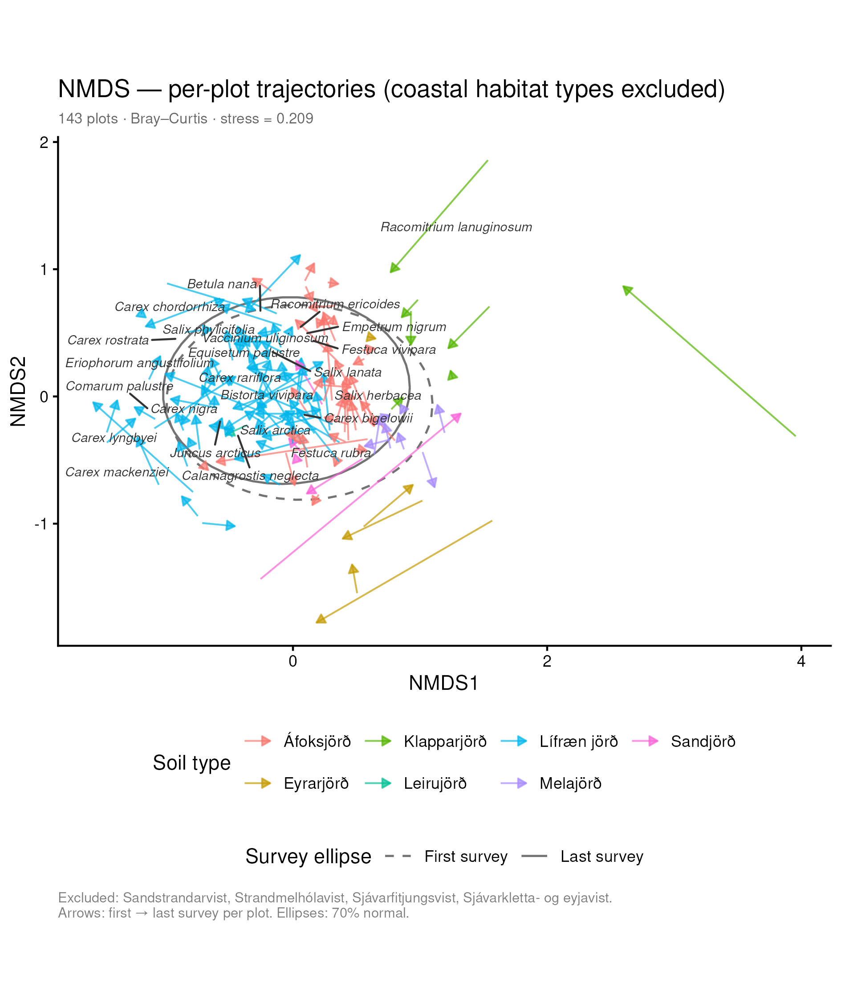
```

The ordination shows a coherent directional shift: the cloud of last-survey
points occupies slightly different space from the first-survey cloud, indicating
that the temporal change is not random but has a consistent ecological direction
across the majority of plots. Trajectories vary in length (magnitude of change)
and direction (type of change) among plots, reflecting real habitat-level
heterogeneity. Plots on dynamic substrates — riparian soils (eyrarjörð) and
aeolian deposits (áfoksjörð) — tend to show longer arrows than those on stable
organic soils (lífræn jörð).

## DCA — the main floristic gradient (with temporal trajectories)

Detrended Correspondence Analysis (DCA; decorana) accommodates the
unimodal species–environment relationships that characterise Icelandic
vegetation data and expresses axis lengths in standard deviation (SD) units of
species turnover, making ecological distances directly comparable. Coastal
habitat types (strandvistgerðir) are excluded. Axis lengths consistently exceed
3 SD, confirming that the dataset spans several complete species replacements —
a gradient too long for PCA to represent faithfully.

```{r fig-dca-arrows, fig.cap="**Figure 2.** DCA biplot with significant envfit vectors (p < 0.05, grey arrows) and topography (landslagsform) centroids (triangles). Points are coloured by moisture class (rakastig); shape distinguishes first from last survey. Arrow direction indicates the environmental gradient most strongly correlated with community composition; arrow length is proportional to correlation strength (r²)."}
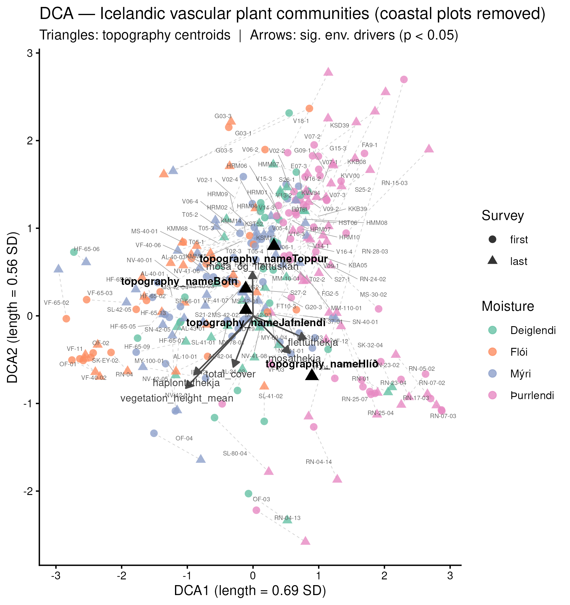
```

```{r fig-dca-traj, fig.cap="**Figure 3.** DCA with per-plot temporal trajectories: dashed lines connect the first and last survey of the same plot. The consistent direction of most trajectories indicates a systematic floristic shift along the main DCA gradient. Plots near the wet end of the moisture gradient (right side) tend to show larger displacement."}
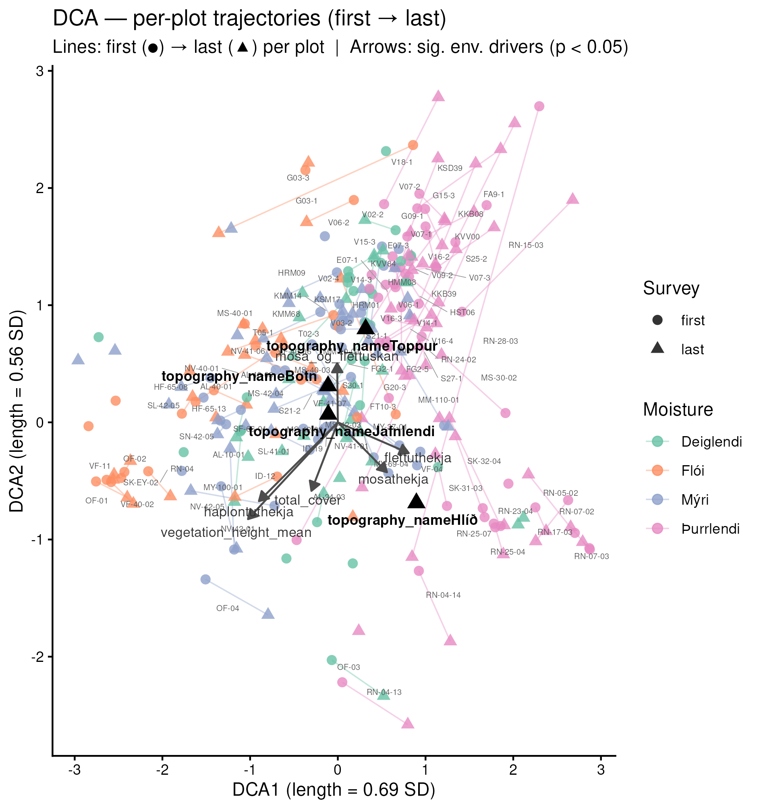
```

> **A note on interpreting the overall ordinations.** The NMDS and DCA above
> confirm that a temporal signal exists and show the main environmental
> gradients structuring Icelandic plant communities. Their limitation as tools
> for reading *what* changed and *where* is structural: the primary axes are
> dominated by floristic distance *between* habitat types. Mires
> (mýrar og flóar), heaths (móar), and lava communities (hraunvistgerðir)
> sit in distinct regions of ordination space, and the within-plot temporal
> arrows are short relative to that between-habitat spread — the signal is
> real but visually compressed. The within-habitat ordinations in
> **Section 7.4 and 7.5** resolve this by running each ordination on a single
> habitat group: without the between-habitat gradient filling the axes, the
> temporal trajectories become the dominant structure and their ecological
> direction becomes directly readable against the species and environmental
> gradient context.

---

# Compositional turnover magnitude {#turnover}

## Overall turnover and variation by soil type {#bc-soil}

Per-plot Bray–Curtis dissimilarity between first and last survey provides a
direct, ecologically interpretable measure of compositional change: 0 indicates
identical communities, 1 indicates complete species replacement. One value is
calculated per plot.

**Across all `r n_plots` plots:** median BC = `r bc_overall_med`,
mean BC = `r bc_overall_mean`. Turnover is therefore substantial — the average
plot replaced roughly half of its compositional weight over the survey interval.

```{r fig-bc-soil, fig.cap="**Figure 4.** Per-plot Bray–Curtis dissimilarity (first → last survey) by soil type (jarðvegstegund). Boxes show median and interquartile range; individual points are plots. Soil types are ordered from greatest to least compositional change. Riparian soils (eyrarjörð) and sandy soils (sandjörð) show the highest turnover; silty soils (leirujörð) the lowest."}
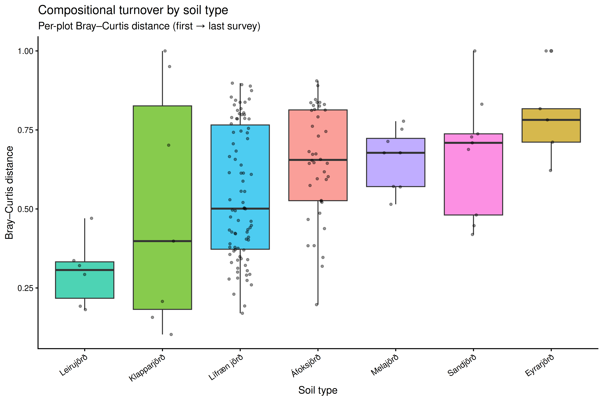
```

```{r tab-bc-soil}
bc_soil_tbl %>%
  rename(
    "Soil type (jarðvegstegund)" = soil_type_name,
    "n plots"   = n,
    "Median BC" = median_bc,
    "Mean BC"   = mean_bc,
    "SD"        = sd_bc
  ) %>%
  kable(
    caption = "**Table 1.** Per-plot Bray–Curtis dissimilarity (first → last survey) summarised by soil type (jarðvegstegund). Ordered from greatest to least median change. BC = Bray–Curtis dissimilarity (0 = identical, 1 = no shared species).",
    align   = c("l", "r", "r", "r", "r")
  ) %>%
  kable_styling(
    bootstrap_options = c("striped", "hover", "condensed"),
    full_width        = FALSE
  )
```

The pattern reflects substrate stability and hydrological dynamics. Riparian
soils (eyrarjörð) and sandy soils (sandjörð) are subject to physical
disturbance and lateral movement that promote rapid floristic turnover
independently of climate. Organic soils (lífræn jörð), which support the
majority of Icelandic lowland mire vegetation (mýraveldi), show moderate
turnover consistent with a structurally buffered but biologically responsive
community. The low turnover on silty soils (leirujörð) likely reflects the
hydrologically stable, fine-textured sediment environments where those soils
form.

## Does turnover accumulate with survey interval? {#bc-gap}

A linear regression and Spearman rank correlation tested whether plots surveyed
after longer intervals showed greater compositional change.

**Result:** slope = `r slope_est` BC units per year
(R² = `r r2_gap`, p `r fmt_p(p_gap)`; Spearman ρ = `r round(cor_gap$estimate, 3)`,
p `r fmt_p(cor_gap$p.value)`).

```{r fig-bc-gap, eval=file.exists("outputs/bc_vs_gap.png"), fig.cap="**Figure 5.** Per-plot Bray–Curtis dissimilarity as a function of survey interval (years). Red dashed line: linear fit with 95% CI; blue curve: loess smoother. A positive, non-saturating trend indicates that compositional change continues to accumulate with time — supporting the case for continued monitoring."}
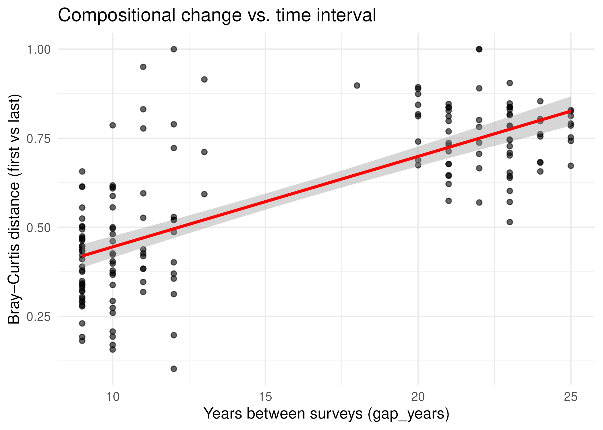
```

```{r bc-gap-text, results='asis'}
if (p_gap < 0.05 && slope_est > 0) {
  cat(
    sprintf(
      "Turnover accumulates significantly with survey interval (slope = +%.4f BC units/year).",
      slope_est
    ),
    "The non-saturating trend in the loess smoother indicates that continued monitoring will",
    "resolve additional change — plots resurveyed after a further 10 years are expected to show,",
    sprintf("on average, %.3f more BC dissimilarity than they show today.", slope_est * 10)
  )
} else if (p_gap >= 0.05) {
  cat(
    sprintf(
      "No significant linear relationship between survey interval and BC dissimilarity was detected (slope = %.4f, p %s).",
      slope_est, fmt_p(p_gap)
    ),
    "This does not exclude ongoing change, but the current data cannot demonstrate that longer",
    "intervals produce greater turnover. Inspect the loess smoother for a non-linear pattern",
    "(e.g. rapid early change followed by a plateau)."
  )
}
```

---

# Indicator species {#indval}

Indicator species analysis (IndVal.g, 999 permutations) identified taxa
significantly associated with either the first or last survey across all plots.
**`r nrow(indval_tbl)` taxa** passed raw permutation p ≤ 0.05:
`r n_indval_first` associated with the **first survey** and
`r n_indval_last` associated with the **last survey**.

```{r fig-indval, fig.cap="**Figure 6.** Top 15 indicator taxa (vísistegundir) per survey by IndVal.g statistic (raw p ≤ 0.05). Taxa in the left panel were more strongly associated with the first survey; those in the right panel with the last survey. The pattern is consistent with ongoing thermophilisation and competitive exclusion of cold-climate specialists."}
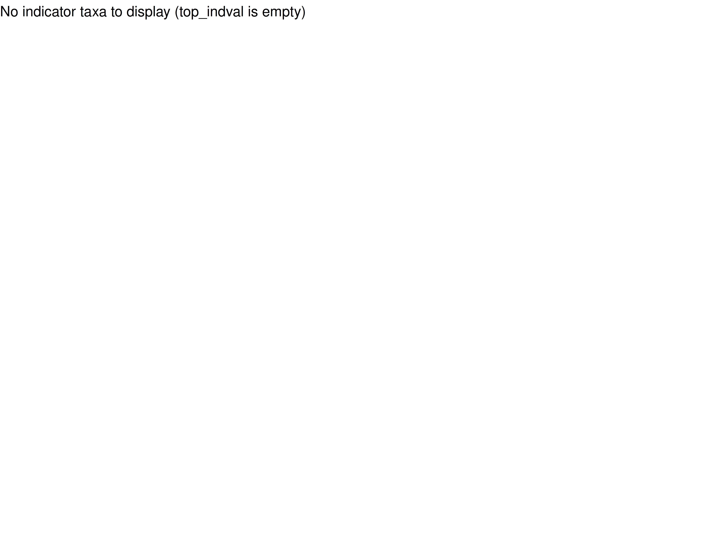
```

```{r tab-indval-first}
indval_tbl %>%
  filter(group == 1L) %>%
  select(taxon, stat, p.value, p_adj, sig) %>%
  slice_head(n = 20) %>%
  rename(
    "Taxon"       = taxon,
    "IndVal stat" = stat,
    "p (raw)"     = p.value,
    "p (BH adj)"  = p_adj,
    "Sig."        = sig
  ) %>%
  mutate(across(c("IndVal stat", "p (raw)", "p (BH adj)"), ~ round(.x, 3))) %>%
  kable(
    caption = "**Table 2a.** Indicator taxa for the **first survey** (fyrsta könnun) — species more abundant or more consistently present in the earlier time point. Ordered by raw p-value. These are predominantly cold-climate specialists and early-successional species that have declined.",
    align   = c("l", "r", "r", "r", "c")
  ) %>%
  kable_styling(bootstrap_options = c("striped", "hover", "condensed"),
                full_width = FALSE)
```

```{r tab-indval-last}
indval_tbl %>%
  filter(group == 2L) %>%
  select(taxon, stat, p.value, p_adj, sig) %>%
  slice_head(n = 20) %>%
  rename(
    "Taxon"       = taxon,
    "IndVal stat" = stat,
    "p (raw)"     = p.value,
    "p (BH adj)"  = p_adj,
    "Sig."        = sig
  ) %>%
  mutate(across(c("IndVal stat", "p (raw)", "p (BH adj)"), ~ round(.x, 3))) %>%
  kable(
    caption = "**Table 2b.** Indicator taxa for the **last survey** (síðasta könnun) — species more abundant or more consistently present in the more recent time point. Ordered by raw p-value. These are predominantly competitive dwarf shrubs, tall herbs, and species associated with productive or moist conditions.",
    align   = c("l", "r", "r", "r", "c")
  ) %>%
  kable_styling(bootstrap_options = c("striped", "hover", "condensed"),
                full_width = FALSE)
```

The contrast between the two groups aligns with the pattern expected from
warming-driven thermophilisation and competitive release: arctic-alpine specialists
(e.g. *Equisetum variegatum*, *Euphrasia frigida*, *Sagina nivalis*,
*Koenigia islandica*) flag the first survey, while competitive low-shrub and
productive fen species (e.g. *Empetrum nigrum*, *Salix arctica*,
*Carex bigelowii*, *Eriophorum angustifolium*) flag the last. This is the
pattern observed across the circumpolar Arctic under ongoing warming.

---

# Changes in vegetation descriptors {#univar}

Paired Wilcoxon signed-rank tests assessed whether continuous vegetation
descriptors changed between first and last survey. Each plot contributes one
matched pair. p-values are BH-adjusted for multiple comparisons.

```{r fig-univar, fig.cap="**Figure 7.** Distribution of per-plot change (last − first) in continuous vegetation descriptors. The violin shows the full distribution of within-plot differences; the boxplot shows median and interquartile range. The dashed line at zero indicates no change. Significance stars (BH-adjusted) are shown above each variable."}
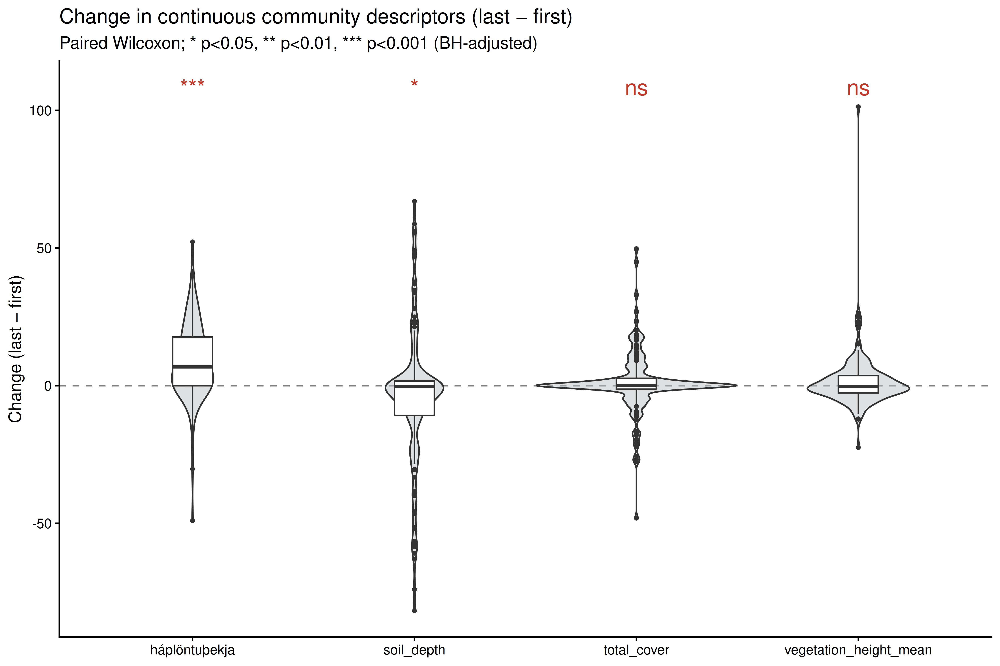
```

```{r tab-univar}
var_labels <- c(
  haplontuthekja       = "Haplontaþekja (vascular cover, %)",
  vegetation_height_mean = "Gróðurhæð (vegetation height, cm)",
  total_cover          = "Heildarþekja (total cover, %)",
  soil_depth           = "Jarðvegsdýpt (soil depth, cm)"
)

wilcox_res %>%
  mutate(
    variable  = var_labels[variable],
    direction = case_when(median_delta > 0 ~ "↑ increase",
                          median_delta < 0 ~ "↓ decrease",
                          TRUE             ~ "—"),
    p_adj     = round(p_adj, 4),
    p         = round(p,     4)
  ) %>%
  select(variable, n, median_first, median_last, median_delta, direction,
         p, p_adj, sig) %>%
  rename(
    "Variable"          = variable,
    "n plots"           = n,
    "Median (first)"    = median_first,
    "Median (last)"     = median_last,
    "Median Δ"          = median_delta,
    "Direction"         = direction,
    "p (raw)"           = p,
    "p (BH adj)"        = p_adj,
    "Sig."              = sig
  ) %>%
  kable(
    caption = "**Table 3.** Paired Wilcoxon signed-rank tests for continuous vegetation descriptors. Median Δ = median of (last − first) across all plots. BH-adjusted p-values; significance: *** p < 0.001, ** p < 0.01, * p < 0.05, ns not significant.",
    align   = c("l", "r", "r", "r", "r", "l", "r", "r", "c")
  ) %>%
  kable_styling(bootstrap_options = c("striped", "hover", "condensed"),
                full_width = FALSE)
```

```{r univar-text, results='asis'}
# Generate a brief narrative sentence for each significant result
sig_vars <- wilcox_res %>% filter(p_adj < 0.05)
if (nrow(sig_vars) > 0) {
  cat("**Significant changes (BH-adjusted p < 0.05):**\n\n")
  for (i in seq_len(nrow(sig_vars))) {
    v   <- sig_vars$variable[i]
    lab <- c(
      haplontuthekja        = "Vascular plant cover (haplontaþekja)",
      vegetation_height_mean = "Mean vegetation height (gróðurhæð)",
      total_cover           = "Total cover (heildarþekja)",
      soil_depth            = "Soil depth (jarðvegsdýpt)"
    )[v]
    dir <- if (sig_vars$median_delta[i] > 0) "increased" else "decreased"
    cat(sprintf(
      "- **%s** %s (median Δ = %+.2f; p_adj %s %s).\n",
      lab, dir, sig_vars$median_delta[i],
      fmt_p(sig_vars$p_adj[i]), sig_vars$sig[i]
    ))
  }
} else {
  cat("No vegetation descriptors showed statistically significant change after BH adjustment.\n")
}
```

---

# Habitat-type analysis {#habitat}

The following sections break down the results by ecologically coherent habitat
groups (vistgerðahópar) following the *Vistgerðir á Íslandi* classification
(Fjölrit Náttúrufræðistofnunar nr. 54, 2016). Plots with DCA1 scores above
`r dca_thresh` SD were excluded from this analysis as compositional outliers
within the inland subset (n = `r length(dca_outlier_ids)` plots excluded).
Only habitat groups with ≥ 10 complete plot pairs are carried forward.

## Habitat group composition

```{r tab-hab-groups}
hab_pair_counts %>%
  filter(habitat_group != "other") %>%
  select(habitat_label, n, n_surveys) %>%
  rename(
    "Habitat group (vistgerðahópur)" = habitat_label,
    "Plot pairs (stikusvæðapar)"     = n,
    "Survey visits"                   = n_surveys
  ) %>%
  kable(
    caption = "**Table 4.** Plot pairs per habitat group after DCA outlier removal. Groups with ≥ 10 pairs are included in all downstream habitat-level analyses.",
    align   = c("l", "r", "r")
  ) %>%
  kable_styling(bootstrap_options = c("striped", "hover", "condensed"),
                full_width = FALSE)
```

```{r tab-hab-types}
hab_type_detail %>%
  select(habitat_label, habitat_type_name, n) %>%
  rename(
    "Habitat group"           = habitat_label,
    "Vistgerð"                = habitat_type_name,
    "Plot pairs"              = n
  ) %>%
  kable(
    caption = "**Table 5.** Icelandic habitat types (vistgerðir) within each habitat group, with number of plot pairs. Type names follow *Vistgerðir á Íslandi* (2016).",
    align   = c("l", "l", "r")
  ) %>%
  kable_styling(bootstrap_options = c("striped", "hover", "condensed"),
                full_width = FALSE) %>%
  collapse_rows(columns = 1, valign = "top")
```

## Compositional turnover by habitat group

```{r tab-bc-hab}
bc_hab_tbl %>%
  select(habitat_label, n, median_bc, mean_bc, sd_bc) %>%
  rename(
    "Habitat group (vistgerðahópur)" = habitat_label,
    "n plots"   = n,
    "Median BC" = median_bc,
    "Mean BC"   = mean_bc,
    "SD"        = sd_bc
  ) %>%
  kable(
    caption = "**Table 6.** Per-plot Bray–Curtis dissimilarity (first → last survey) summarised by habitat group (vistgerðahópur). Higher values indicate greater compositional turnover.",
    align   = c("l", "r", "r", "r", "r")
  ) %>%
  kable_styling(bootstrap_options = c("striped", "hover", "condensed"),
                full_width = FALSE)
```

## Compositional turnover vs. survey interval by habitat group

The figure below tests whether the rate of change (BC per year) differs between
habitat groups after accounting for survey interval length. Separate regression
lines are fitted for each group; a steeper slope indicates faster accumulation
of floristic change per year.

```{r fig-bc-gap-hab, eval=file.exists("outputs/p_bc_gap_hab.png"), fig.cap="**Figure 8.** Bray–Curtis dissimilarity vs. survey interval (years) by habitat group (vistgerðahópur). Each point is one plot; coloured lines and shading show group-level OLS fits with 95% confidence intervals. Differences in slope between groups indicate habitat-specific rates of change."}
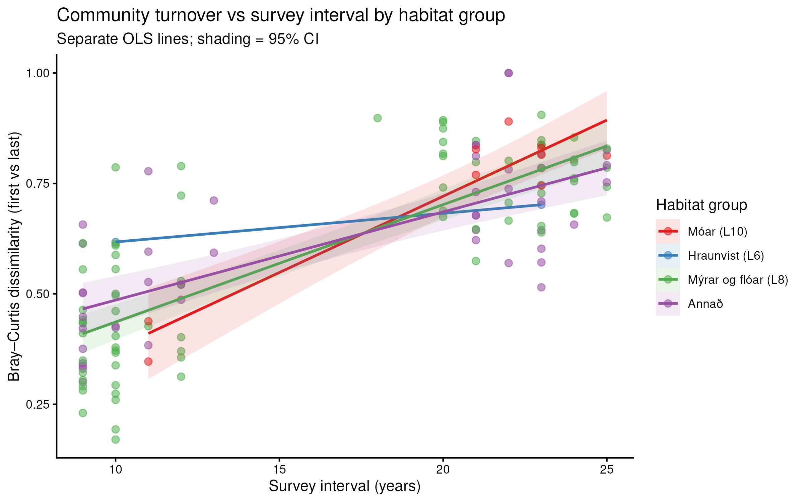
```

```{r fig-bc-gap-hab-missing, eval=!file.exists("outputs/p_bc_gap_hab.png"), results='asis'}
cat("> *Figure 8 will appear here after the full analysis document (v_plants_analysis.Rmd) has been knitted.*")
```

## Within-habitat PCoA — trajectory plots {#pcoa-hab}

The overall NMDS and DCA mix all habitat types together; the between-habitat
gradient fills the ordination space. The plots below run a separate ordination
(PCoA, Bray–Curtis) within each habitat group (vistgerðahópur). Each axis now
represents compositional variation *inside* that one habitat type — moisture
gradients within mires (rakastig í mýrum), grazing or altitude gradients within
heaths (beit eða hæð í móum), and so on. Within this more focused space, the
temporal trajectories (arrows, first → last survey) become the dominant
structure rather than a secondary signal, and their direction indicates which
ecological dimension the community is shifting along. Species labels show
weighted-average positions of the top taxa — a species label placed at the head
end of most arrows indicates it increased; one at the tail end indicates it
declined. Points are coloured by moisture class (rakastig).

```{r hab-pcoa-plots, fig.height=6, fig.width=8, fig.cap="Within-habitat PCoA trajectory plots — see individual titles for habitat group. Circle = first survey (fyrsta könnun); triangle = last survey (síðasta könnun). Arrows connect surveys of the same plot. Italic labels: species weighted-average positions on the two PCoA axes (top 12 by distance from origin)."}

for (grp in groups_sufficient) {

  # ── Subset ──────────────────────────────────────────────────────────────────
  meta_g <- meta_hab_r %>% filter(habitat_group == grp)
  ids_g  <- paste(meta_g$plot_number, meta_g$sample, sep = "_")

  mat_g  <- mat_core_inland[rownames(mat_core_inland) %in% ids_g, , drop = FALSE]
  mat_g  <- mat_g[, colSums(mat_g) > 0, drop = FALSE]
  # align meta to matrix rows that exist
  ids_ok <- ids_g[ids_g %in% rownames(mat_g)]
  mat_g  <- mat_g[ids_ok, ]
  meta_g <- meta_g[paste(meta_g$plot_number, meta_g$sample, sep = "_") %in% ids_ok, ]

  # ── PCoA ────────────────────────────────────────────────────────────────────
  d_g    <- vegdist(mat_g, method = "bray")
  pcoa_g <- cmdscale(d_g, k = 2, eig = TRUE)

  pcoa_df <- as.data.frame(pcoa_g$points) %>%
    setNames(c("PCo1", "PCo2")) %>%
    mutate(
      plot_number = meta_g$plot_number,
      sample      = meta_g$sample,
      moisture    = if ("moisture_name" %in% names(meta_g))
                      meta_g$moisture_name else NA_character_
    )

  eig_pos <- pcoa_g$eig[pcoa_g$eig > 0]
  var_ex  <- round(100 * eig_pos[1:2] / sum(eig_pos), 1)

  # Species weighted averages: wa[taxon, axis] = sum(cover * score) / sum(cover)
  wa_mat <- t(mat_g) %*% as.matrix(pcoa_df[, c("PCo1", "PCo2")])
  wa_sp  <- as.data.frame(wa_mat / (colSums(mat_g) + 1e-9)) %>%
    rownames_to_column("taxon") %>%
    mutate(dist_orig = sqrt(PCo1^2 + PCo2^2)) %>%
    arrange(desc(dist_orig)) %>%
    slice_head(n = 12)

  # Trajectory table (one row per plot)
  traj_g <- pcoa_df %>%
    pivot_wider(
      id_cols     = c(plot_number, moisture),
      names_from  = sample,
      values_from = c(PCo1, PCo2)
    )

  # ── Plot ────────────────────────────────────────────────────────────────────
  p_pcoa <- ggplot() +
    geom_segment(
      data      = traj_g,
      aes(x = PCo1_first, y = PCo2_first,
          xend = PCo1_last, yend = PCo2_last,
          colour = moisture),
      arrow     = arrow(length = unit(0.16, "cm"), type = "open"),
      linewidth = 0.55, alpha = 0.75
    ) +
    geom_point(
      data   = pcoa_df %>% filter(sample == "first"),
      aes(x = PCo1, y = PCo2, colour = moisture),
      shape = 16, size = 2.3, alpha = 0.9
    ) +
    geom_point(
      data   = pcoa_df %>% filter(sample == "last"),
      aes(x = PCo1, y = PCo2, colour = moisture),
      shape = 17, size = 2.3, alpha = 0.9
    ) +
    geom_label_repel(
      data    = wa_sp,
      aes(x = PCo1, y = PCo2, label = taxon),
      size    = 2.4, fontface = "italic",
      fill    = alpha("white", 0.75), label.size = 0,
      max.overlaps = 15, seed = 42, colour = "grey25"
    ) +
    scale_colour_brewer(palette = "Set2", name = "Moisture (rakastig)",
                        na.translate = FALSE) +
    labs(
      title    = paste0("Within-habitat PCoA — ", hab_display[grp]),
      subtitle = sprintf(
        "%d plot pairs · ● first survey · ▲ last survey · italic = species WA positions",
        nrow(traj_g)
      ),
      x = sprintf("PCo1 (%.1f%% of variance)", var_ex[1]),
      y = sprintf("PCo2 (%.1f%% of variance)", var_ex[2])
    ) +
    theme_classic(base_size = 11) +
    theme(legend.position = "bottom")

  print(p_pcoa)
}
```

## Within-habitat dbRDA — constrained ordination biplots {#dbrda-hab}

Distance-based redundancy analysis (dbRDA; capscale, Bray–Curtis) with
`Condition(plot_number)` partitions the within-plot temporal change away from
the among-plot baseline differences, then constrains the ordination axes to be
linear combinations of the environmental predictors. The plots below show the
sites in that constrained ordination space: CAP1 and CAP2 are the directions
of community change most strongly predicted by the environmental variables.
Red arrows show the environmental predictors (endurkönnunarbil, hæð yfir
sjávarmáli, jarðvegsdýpt, rakastig, landslagsform, drenjur); a predictor arrow
pointing in the direction most arrows travel means that variable is driving
the temporal change in this habitat group. Species labels mark the weighted
average positions of the top taxa on the constrained axes.

Where the constrained axes explain a small proportion of total inertia, the
PCoA trajectory plots above (which are unconstrained) are more informative for
reading the full range of community change; the dbRDA biplot is informative for
identifying *which environmental gradient* the change tracks.

```{r hab-dbrda-plots, fig.height=6.5, fig.width=7.5, fig.cap="Within-habitat dbRDA ordination biplots — see individual titles. Blue circles = first survey; orange triangles = last survey; grey arrows connect surveys of the same plot. Red arrows = environmental predictors; all included predictors are shown (permutation significance of individual terms is reported in the full analysis document). Italic labels: species weighted averages on the constrained axes."}

for (grp in groups_sufficient) {

  # ── Subset (same as PCoA above, must re-derive for cache independence) ──────
  meta_g <- meta_hab_r %>%
    filter(habitat_group == grp) %>%
    left_join(gap_tbl %>% select(plot_number, gap_years),
              by = "plot_number", suffix = c("", ".gap"))
  # If gap_years already in meta_hab_r (inherited from meta_strict), avoid dup
  if ("gap_years.gap" %in% names(meta_g)) {
    meta_g <- meta_g %>%
      mutate(gap_years = coalesce(gap_years, gap_years.gap)) %>%
      select(-gap_years.gap)
  }

  ids_g  <- paste(meta_g$plot_number, meta_g$sample, sep = "_")
  mat_g  <- mat_core_inland[rownames(mat_core_inland) %in% ids_g, , drop = FALSE]
  mat_g  <- mat_g[, colSums(mat_g) > 0, drop = FALSE]
  ids_ok <- ids_g[ids_g %in% rownames(mat_g)]
  mat_g  <- mat_g[ids_ok, ]
  meta_g <- meta_g[paste(meta_g$plot_number, meta_g$sample, sep = "_") %in% ids_ok, ]

  # ── Predictor screening ──────────────────────────────────────────────────────
  candidate_preds <- c("gap_years", "haeddypimetrar", "soil_depth",
                       "moisture_name", "topography_name", "permafrost")

  meta_cc <- meta_g %>%
    mutate(across(where(is.character), as.factor),
           across(where(is.logical),   as.factor)) %>%
    select(plot_number, sample,
           any_of(candidate_preds)) %>%
    drop_na()

  # Keep only predictors that are present and have variance
  usable <- intersect(candidate_preds, names(meta_cc))
  usable <- usable[vapply(usable, function(v) {
    col <- meta_cc[[v]]
    if (is.numeric(col)) var(col, na.rm = TRUE) > 1e-8
    else length(unique(col)) > 1
  }, logical(1))]

  if (length(usable) == 0 || nrow(meta_cc) < 8) {
    cat(sprintf(
      "\n\n> *dbRDA biplot for **%s** omitted — insufficient complete-case rows or no variable predictors.*\n\n",
      hab_display[grp]
    ))
    next
  }

  meta_cc <- meta_cc %>% select(plot_number, sample, all_of(usable))
  cc_ids  <- paste(meta_cc$plot_number, meta_cc$sample, sep = "_")
  mat_cc  <- mat_g[rownames(mat_g) %in% cc_ids, , drop = FALSE]
  mat_cc  <- mat_cc[, colSums(mat_cc) > 0, drop = FALSE]
  mat_cc  <- mat_cc[paste(meta_cc$plot_number, meta_cc$sample, sep = "_"), ]

  fml <- as.formula(paste0(
    "mat_cc ~ ",
    paste(c(usable, "Condition(plot_number)"), collapse = " + ")
  ))

  # ── capscale ─────────────────────────────────────────────────────────────────
  set.seed(123)
  ord_cap <- tryCatch(
    capscale(fml, data = meta_cc, distance = "bray"),
    error = function(e) { message(grp, ": ", e$message); NULL }
  )

  if (is.null(ord_cap) || is.null(ord_cap$CCA) || length(ord_cap$CCA$eig) == 0) {
    cat(sprintf(
      "\n\n> *dbRDA biplot for **%s** could not be fitted (model produced no constrained axes).*\n\n",
      hab_display[grp]
    ))
    next
  }

  n_axes   <- min(2L, length(ord_cap$CCA$eig))
  ax_names <- paste0("CAP", seq_len(n_axes))

  # ── Extract scores ────────────────────────────────────────────────────────────
  cap_sites <- as.data.frame(
    scores(ord_cap, display = "sites", choices = seq_len(n_axes))
  ) %>%
    setNames(ax_names) %>%
    bind_cols(meta_cc %>% select(plot_number, sample))
  if (n_axes < 2) cap_sites$CAP2 <- 0

  traj_cap <- cap_sites %>%
    pivot_wider(
      id_cols    = plot_number,
      names_from = sample,
      values_from = c(CAP1, CAP2)
    )

  sp_cap <- tryCatch({
    as.data.frame(
      scores(ord_cap, display = "species", choices = seq_len(n_axes))
    ) %>%
      setNames(ax_names) %>%
      rownames_to_column("taxon") %>%
      { if (!"CAP2" %in% names(.)) mutate(., CAP2 = 0) else . } %>%
      mutate(dist_orig = sqrt(CAP1^2 + CAP2^2)) %>%
      arrange(desc(dist_orig)) %>%
      slice_head(n = 12)
  }, error = function(e) NULL)

  bp_cap <- tryCatch({
    as.data.frame(
      scores(ord_cap, display = "bp", choices = seq_len(n_axes))
    ) %>%
      setNames(ax_names) %>%
      rownames_to_column("predictor") %>%
      { if (!"CAP2" %in% names(.)) mutate(., CAP2 = 0) else . }
  }, error = function(e) NULL)

  # Scale arrows to site score range
  sc <- max(abs(cap_sites[, c("CAP1", "CAP2")])) * 0.65

  # Variance on constrained axes
  eig_cap <- ord_cap$CCA$eig
  pct_cap <- round(100 * eig_cap[1:n_axes] / ord_cap$tot.chi, 1)

  # ── Plot ──────────────────────────────────────────────────────────────────────
  p_cap <- ggplot() +
    geom_vline(xintercept = 0, linetype = "dashed",
               colour = "grey85", linewidth = 0.3) +
    geom_hline(yintercept = 0, linetype = "dashed",
               colour = "grey85", linewidth = 0.3) +
    # Temporal trajectories
    geom_segment(
      data      = traj_cap,
      aes(x = CAP1_first, y = CAP2_first,
          xend = CAP1_last, yend = CAP2_last),
      arrow     = arrow(length = unit(0.16, "cm"), type = "open"),
      colour    = "grey55", linewidth = 0.5, alpha = 0.65
    ) +
    # Survey points
    geom_point(
      data   = cap_sites %>% filter(sample == "first"),
      aes(x = CAP1, y = CAP2),
      colour = "#2980b9", shape = 16, size = 2.5
    ) +
    geom_point(
      data   = cap_sites %>% filter(sample == "last"),
      aes(x = CAP1, y = CAP2),
      colour = "#e67e22", shape = 17, size = 2.5
    ) +
    # Environmental predictor arrows
    { if (!is.null(bp_cap) && nrow(bp_cap) > 0)
        list(
          geom_segment(
            data = bp_cap,
            aes(x = 0, y = 0, xend = CAP1 * sc, yend = CAP2 * sc),
            arrow = arrow(length = unit(0.2, "cm")),
            colour = "#c0392b", linewidth = 0.9, inherit.aes = FALSE
          ),
          geom_label(
            data = bp_cap,
            aes(x = CAP1 * sc * 1.18, y = CAP2 * sc * 1.18, label = predictor),
            size = 2.8, colour = "#c0392b",
            fill = alpha("white", 0.8), label.size = 0, inherit.aes = FALSE
          )
        )
      else list()
    } +
    # Species weighted-average labels
    { if (!is.null(sp_cap) && nrow(sp_cap) > 0)
        geom_label_repel(
          data    = sp_cap,
          aes(x = CAP1, y = CAP2, label = taxon),
          size    = 2.3, fontface = "italic",
          fill    = alpha("white", 0.75), label.size = 0,
          max.overlaps = 12, seed = 42, colour = "grey30",
          inherit.aes = FALSE
        )
      else list()
    } +
    labs(
      title    = paste0("dbRDA biplot — ", hab_display[grp]),
      subtitle = sprintf(
        "● first survey · ▲ last survey · red arrows = environmental predictors · italic = species WA\nCAP1 = %.1f%% of total inertia%s",
        pct_cap[1],
        if (n_axes > 1) sprintf("; CAP2 = %.1f%%", pct_cap[2]) else ""
      ),
      x = sprintf("CAP1 (%.1f%% of total inertia)", pct_cap[1]),
      y = if (n_axes > 1) sprintf("CAP2 (%.1f%%)", pct_cap[2]) else "CAP2"
    ) +
    theme_classic(base_size = 11) +
    theme(plot.subtitle = element_text(size = 8, colour = "grey40"))

  print(p_cap)
}
```

## Environmental drivers per habitat group — distance-based RDA

For each habitat group, a distance-based redundancy analysis (dbRDA, capscale,
Bray–Curtis) with `Condition(plot_number)` was used to isolate within-plot
temporal change. Six candidate environmental drivers were tested:
survey interval (endurkönnunarbil), elevation (hæð yfir sjávarmáli, haeddypimetrar),
soil depth (jarðvegsdýpt), moisture class (rakastig), topography (landslagsform),
and permafrost presence (drenjur). Permutation tests identified significant
individual predictors after marginal adjustment.

*Full numerical results of the permutation tests (anova.cca by = "margin") are
in the full analysis document. Significant predictors per habitat group are
visible as the environmental arrows in the dbRDA biplots above.*

## Species driving temporal change — per habitat group

For each sufficient habitat group, the following figures show (left panel) the
species loadings on the primary constrained dbRDA axis — the taxa most strongly
associated with the direction of temporal change — and (right panel) the top 20
gainers and losers by mean cover change (last − first), with significant taxa
(paired Wilcoxon, raw p ≤ 0.05) shown in solid colour.

---

### Mires and fens — Mýrar og flóar (L8) {#hab-mire}

```{r fig-rda-mire, eval=file.exists("outputs/p_sp_rda_myrar_floar.png"), fig.cap="**Figure 9a.** Species loadings on the primary constrained dbRDA axis — Mýrar og flóar (L8). Positive loadings (red) indicate species associated with the direction of temporal change; negative loadings (blue) indicate species associated with the earlier community state."}
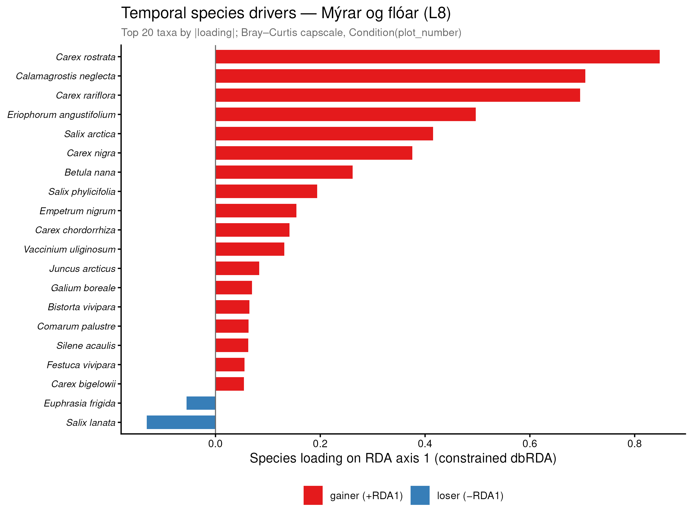
```

```{r fig-gainers-mire, eval=file.exists("outputs/p_gainers_losers_myrar_floar.png"), fig.cap="**Figure 9b.** Mean cover change (last − first, Braun–Blanquet units) per species — Mýrar og flóar (L8). Top 20 gainers and top 20 losers by mean Δcover. Solid colours: significant paired Wilcoxon (raw p ≤ 0.05); faded: non-significant. Species in italics."}
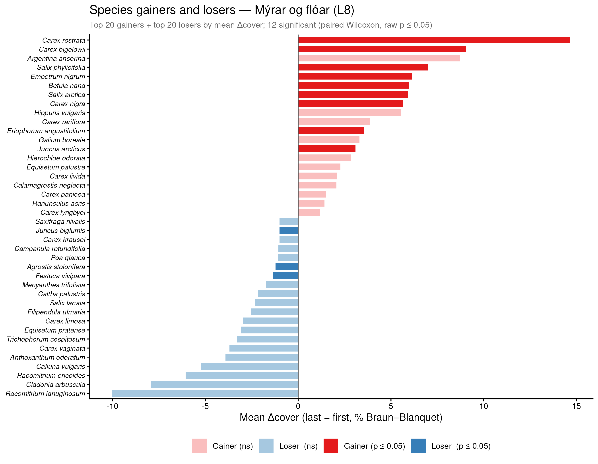
```

```{r fig-mire-missing, eval=!file.exists("outputs/p_gainers_losers_myrar_floar.png"), results='asis'}
cat("> *Figures 9a–b will appear here after the full analysis document has been knitted.*")
```

---

### Heathlands — Móar (L10) {#hab-heath}

```{r fig-rda-heath, eval=file.exists("outputs/p_sp_rda_moar.png"), fig.cap="**Figure 10a.** Species loadings on the primary constrained dbRDA axis — Móar (L10)."}
include_graphics("outputs/p_sp_rda_moar.png")
```

```{r fig-gainers-heath, eval=file.exists("outputs/p_gainers_losers_moar.png"), fig.cap="**Figure 10b.** Mean cover change (last − first) per species — Móar (L10). Top 20 gainers and top 20 losers."}
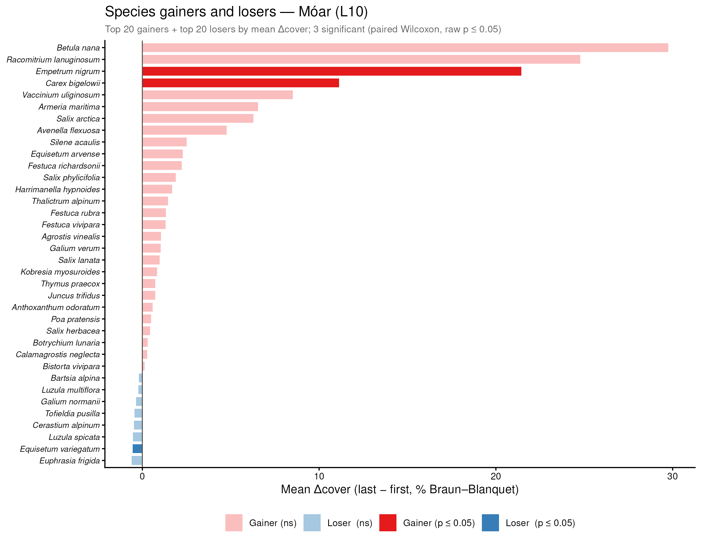
```

```{r fig-heath-missing, eval=!file.exists("outputs/p_gainers_losers_moar.png"), results='asis'}
cat("> *Figures 10a–b will appear here after the full analysis document has been knitted.*")
```

---

### Lava fields — Hraunvist (L6) {#hab-lava}

```{r fig-rda-lava, eval=file.exists("outputs/p_sp_rda_hraunvist.png"), fig.cap="**Figure 11a.** Species loadings on the primary constrained dbRDA axis — Hraunvist (L6)."}
include_graphics("outputs/p_sp_rda_hraunvist.png")
```

```{r fig-gainers-lava, eval=file.exists("outputs/p_gainers_losers_hraunvist.png"), fig.cap="**Figure 11b.** Mean cover change (last − first) per species — Hraunvist (L6). Top 20 gainers and top 20 losers."}
include_graphics("outputs/p_gainers_losers_hraunvist.png")
```

```{r fig-lava-missing, eval=!file.exists("outputs/p_gainers_losers_hraunvist.png"), results='asis'}
cat("> *Figures 11a–b will appear here after the full analysis document has been knitted.*")
```

---

# Coastal plots {#coastal}

The three coastal outlier plots, excluded from all main analyses, are shown
below for completeness. Their communities are dominated by coastal and sand-dune
specialists (strandplöntur) typical of *Strandmelhólavist* and related
coastal habitat types, and their floristic distance from the inland vegetation
is so large that they compress the ordination space if included.

```{r fig-coastal, fig.cap="**Figure 12.** PCoA of the three excluded coastal plots (strandsvæði). Lines connect first and last survey of the same plot. The three plots separate clearly in ordination space, reflecting their distinct community compositions."}
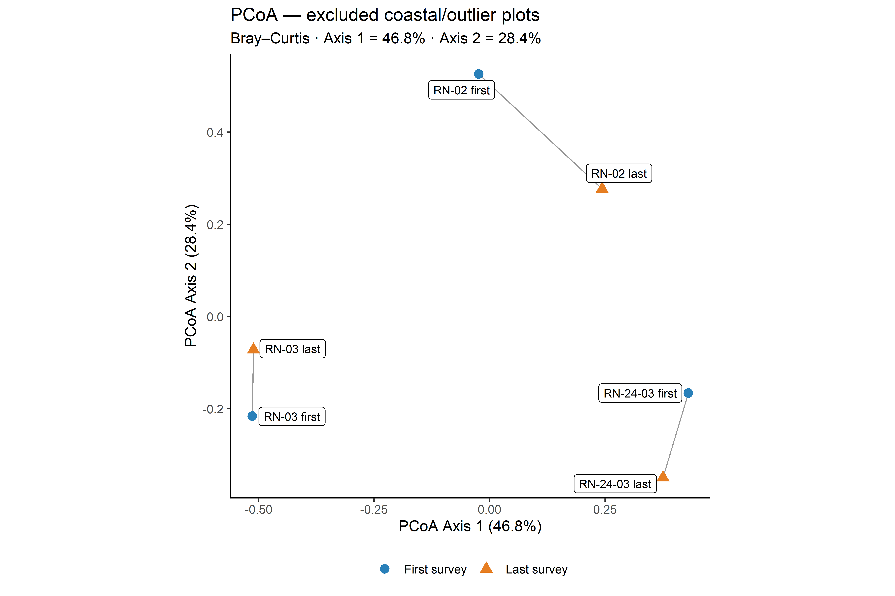
```

---

# Summary of findings

```{r summary-table}
# Build a concise findings overview
findings <- tribble(
  ~Finding, ~Result,
  "Overall temporal change (PERMANOVA)",
    sprintf("F(%d,%d) = %.2f, R² = %.1f%%, p %s — statistically unambiguous",
            perm_df1, perm_df2, perm_f, perm_r2, fmt_p(perm_p)),
  "Median Bray–Curtis dissimilarity (all plots)",
    sprintf("%.3f (mean = %.3f) — substantial community turnover", bc_overall_med, bc_overall_mean),
  "Change accumulates with survey interval",
    sprintf("slope = %+.4f BC/year, Spearman ρ = %.3f (p %s)",
            slope_est, cor_gap$estimate, fmt_p(cor_gap$p.value)),
  "Indicator taxa (IndVal.g, raw p ≤ 0.05)",
    sprintf("%d taxa: %d associated with first survey, %d with last survey",
            nrow(indval_tbl), n_indval_first, n_indval_last),
  "Habitat groups analysed (≥ 10 pairs)",
    paste(hab_display[groups_sufficient], collapse = "; "),
  "DCA outliers excluded from habitat analysis",
    sprintf("%d plot(s) with DCA1 > %.1f SD", length(dca_outlier_ids), dca_thresh)
)

kable(findings,
      caption = "**Table 7.** Summary of key findings. Full statistical outputs and species-level results are provided in the sections above.",
      col.names = c("Finding", "Result")) %>%
  kable_styling(bootstrap_options = c("striped", "hover"),
                full_width = TRUE) %>%
  column_spec(1, bold = TRUE, width = "30%") %>%
  column_spec(2, width = "70%")
```

The overall picture is consistent with vegetation responses documented across
the circumpolar North: cold-climate specialists (háfjallategundir og
norrænar tegundir) are declining, while competitive
dwarf shrubs, productive sedges, and tall herbs are expanding. The signal is
visible across habitat types but varies in magnitude and species composition.
Mires and fens (mýrar og flóar), which cover a large share of the Icelandic
lowland landscape and carry high conservation value (verndargildi), appear
particularly dynamic. The positive and non-saturating relationship between
survey interval and turnover magnitude provides empirical support for continued
long-term monitoring (langtímaeftirlit).

---

*Analysis performed in R `r R.version$major`.`r R.version$minor` using vegan,
tidyverse, and indicspecies. Full reproducible code is available in
`v_plants_analysis.Rmd`.*
